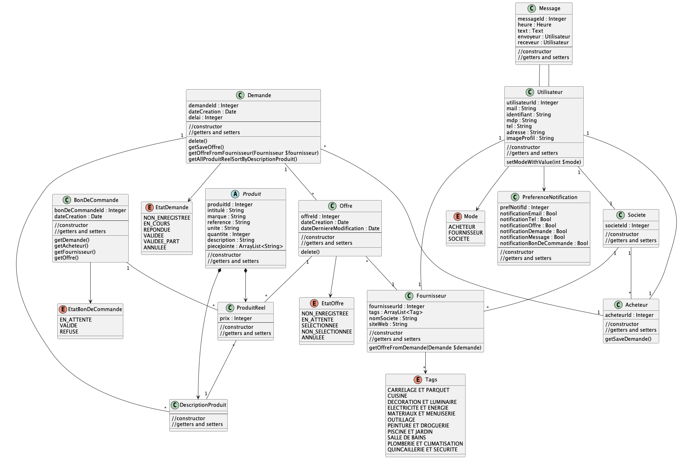

# Entity

## structure


---

- [Entity](#entity)
  - [structure](#structure)
    - [User](#user)
    - [Acheteur](#acheteur)
    - [Fournisseur](#fournisseur)
    - [Demande](#demande)
    - [Offre](#offre)
    - [Produit (Abstraite)](#produit-abstraite)
    - [DescriptionProduit (Extension de Produit)](#descriptionproduit-extension-de-produit)
    - [ProduitReel (Extension de Produit)](#produitreel-extension-de-produit)

---

### User
- Mode  
permet de savoir dans quel mode l'utilisateur se trouve
- Acheteur  
l'attribut acheteur permet de savoir si l'utlisateur est un acheteur
- Fournisseur  
l'attribut fournisseur permet de savoir si l'utlisateur est un fournisseur
- Societe  
l'attribut societe permet de savoir si l'utlisateur est une societe
- setModeWithValue(int $mode)  
change le mode de l'utilisateur selon
```php
1 => Mode::ACHETEUR
2 => Mode::FOURNISSEUR
3 => Mode::SOCIETE
```

---

### Acheteur
- Societe  
l'attribut societe permet de savoir si l'acheteur appartient à un compte société

- getSaveDemande()  
permet de récupérer les demandes validées d'un acheteur, on retire les demande non enregistrée

---

### Fournisseur
- Societe  
l'attribut societe permet de savoir si le fournisseur appartient à un compte société

- getOffreFromDemande(Demande $demande)  
retourne l'offre faite par le fournisseur pour la demande $demande, null si aucune offre n'est faite

---

### Demande
- delete()  
supprime la demande, les produits et les offres associés aussi
- getSaveOffre()  
retourne les offres validées par le fournisseur et non les offres non enregistrée
- getOffreFromFournisseur(Fournisseur $fournisseur)  
retourne l'offre pour la demande faite par le fournisseur $fournisseur, null si aucune offre n'est faite
- getAllProduitReelSortByDescriptionProduit()  
retourne le tableau avec pour chaque id de DescriptionProduit, la liste des ProduitReel associé  
```php
[
    descriptionProduitId => List(ProduitReel)
]
```

---

### Offre
- delete()  
supprime l'offre et les produitReels associés

---

### Produit (Abstraite)

---

### DescriptionProduit (Extension de Produit)
(produit décrit dans les demandes)

---

### ProduitReel (Extension de Produit)
(produit réel qui existe physiquement et peut être acheté)


