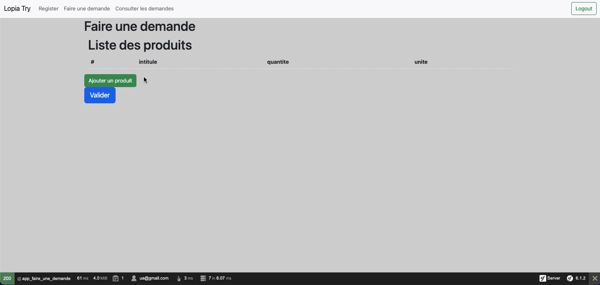

# Diagramme de séquence - Faire une demande

- [Diagramme de séquence - Faire une demande](#diagramme-de-séquence---faire-une-demande)
  - [Diagramme de séquence](#diagramme-de-séquence)
  - [Description](#description)

## Diagramme de séquence

## Description

Pour faire une nouvelle demande sur la plateforme, il faut aller dans le module faire une demande depuis la barre de navigation.  
Cela dirige vers la page pour faire une demande, le contrôleur charge une demande en cours ou crée un nouvel entité `Demande` et affiche la liste des descriptions de produit présent dans la demande.

Il faut ensuite ajouter des descriptions de produit. Le bouton "Ajouter un produit" renvoi vers une page contenant un formulaire permettant de créer la description de produit.  
Le formulaire doit être complété et envoyé avec le bouton "Ajouter".  
Le contrôleur crée l'entité DescriptionProduit et l'ajoute dans la demande.

On retourne alors vers la page pour faire une demande. Les descriptions de produit ajoutées sont affichées et on peut finir par valider la demande. L'état de l'entité Demande est modifié.

