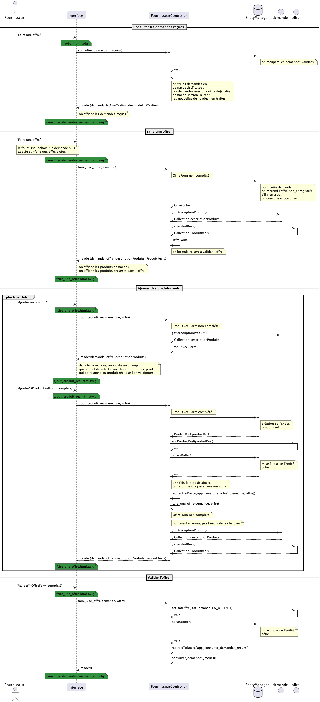
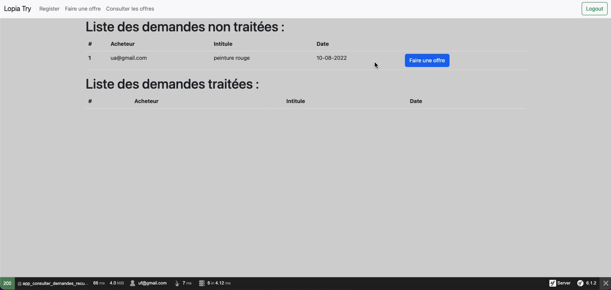
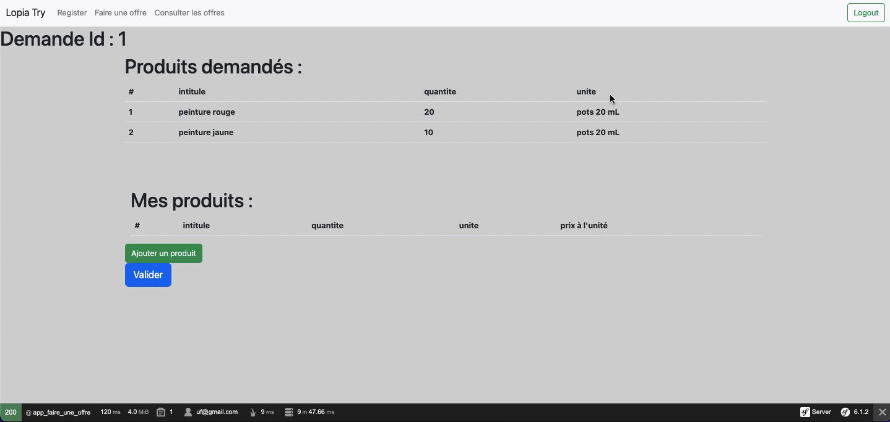
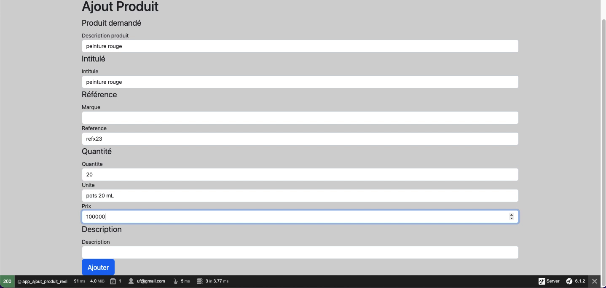
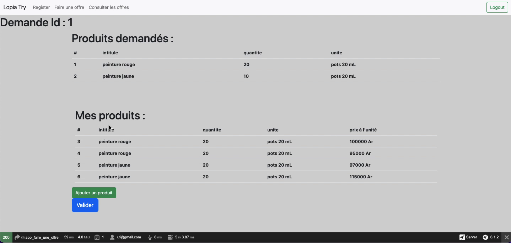

# Diagramme de séquence - Faire une offre

- [Diagramme de séquence - Faire une offre](#diagramme-de-séquence---faire-une-offre)
  - [Diagramme de séquence](#diagramme-de-séquence)
  - [Description](#description)

## Diagramme de séquence

## Description

Dans l'espace fournisseur, "Faire une offre" depuis la barre de navigation mène vers la page permettant de consulter les demandes reçues.

Ensuite, il faut choisir la demande dans la liste pour proposer une offre. On est alors dirigé vers la page pour faire une offre. Le contrôleur charge l'offre en cours ou génère un nouvel entité `Offre`. Il récupère la liste des descriptions de produit de la demande et la liste des produits réels dans l'offre pour les afficher sur la page.

Comme pour les demandes, l'étape suivante consiste à ajouter des produits réels dans l'offre à partir du bouton "Ajouter un produit".  
De la même façon, un formulaire est affiché. Une fois le formulaire remplit, le contrôleur crée l'entité `ProduitReel` et l'insère dans l'offre.

On revient sur la page pour faire une offre, avec les nouveaux produits réels ajoutés. Pour finir l'offre, il suffit de valider ce qui changera le statut de l'offre.

