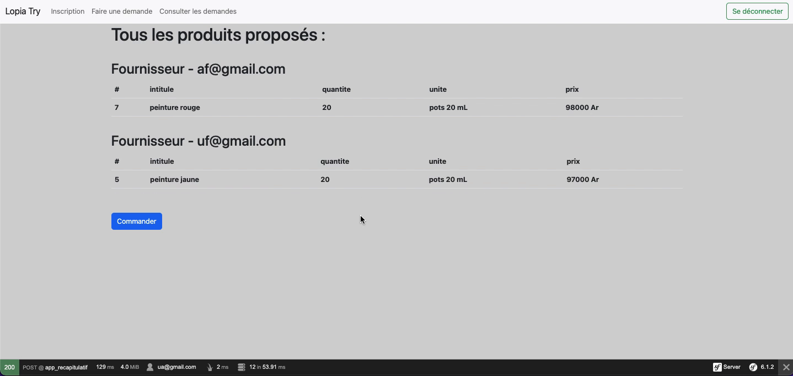

# Diagramme de séquence - Utiliser l'outil de calcul de commande optimale

- [Diagramme de séquence - Utiliser l'outil de calcul de commande optimale](#diagramme-de-séquence---utiliser-loutil-de-calcul-de-commande-optimale)
  - [Diagramme de séquence](#diagramme-de-séquence)
  - [Description](#description)

## Diagramme de séquence

## Description

Pour utiliser l'outil CCO, il faut commencer par consulter les demandes à l'aide de "Consulter les demandes" sur la barre de navigation. Le contrôleur reprend les demandes pour les affichées dans un tableau. Depuis cette page, on accède à l'outil de calcul en sélectionnant "Outil CCO" depuis une demande de la liste.

On arrive alors sur l'outil CCO pour une demande. Le contrôleur collecte tous les produits proposés pour la demande et les inscrit sur la page. Par la suite, il faut sélectionner les produits dont on veut tenir compte dans le calcul de commande et lancer l'outil.

Le contrôleur récupère alors les produits sélectionnés. Il récupère pour chaque description de produit, le produit réel le moins cher. L'outil affiche alors une page récapitulative contenant les produits retenus regroupés par fournisseur.

